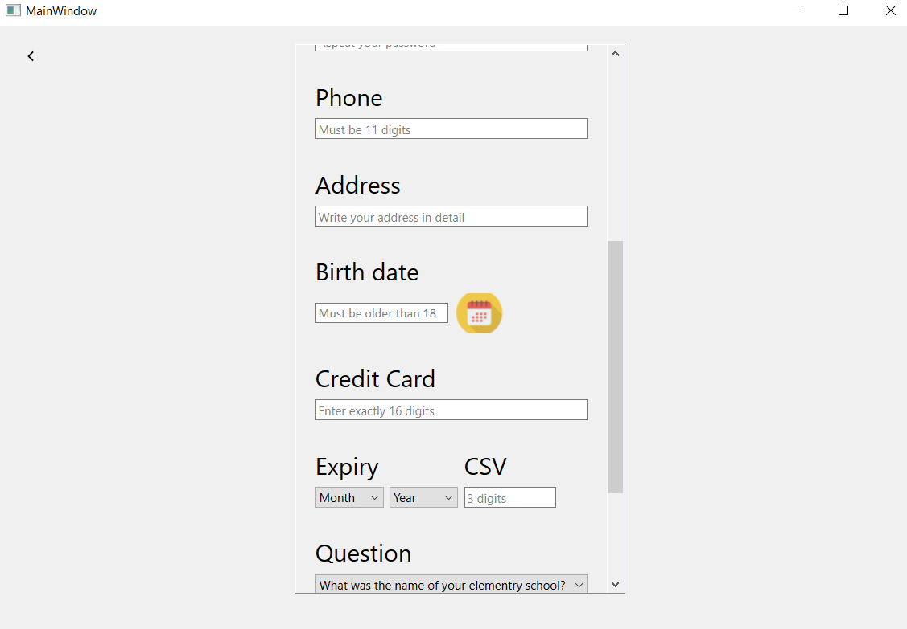

<h1> Simple Marketplace Project </h1>

This Project is a C++ application that simulates a basic marketplace platform. The project aims to showcase concepts of Data Structures and software development. 
The application allows users to register, log in, browse products, sell products, add items to their cart and proceed to checkout. 

<h2> Features </h2>

<h4> User Registration and Login: </h4>

* Each user can choose the type of his account, customer or seller.
* There is information validation in the login and registration pages, the user must fill all the empty boxes with valid information.

<h4> Prouducts Browsing: </h4>

* Homepage: it shows the 6 best selling products and categories.
* Wishlist: It contains the products that the user wants to purchase.
* Buy again: the shopping history of the customer.
* Categories: navigate through different categories.
* Best Sellers: the products sorted by best selling.
* Search Bar: it's implemented using trie tree data structure.
* My Products: This tab lists all the products that the seller is selling.
  
Note: you can sort the products in every tab by rating, price and best selling.

<h4> Product Listing: </h4>

* Each seller can list his products, he must fill in the required information about the product he is listing.

<h4> Product Page: </h4>

* It contains product information.
* Customers can rate the products and share their thoughts about them.
* Customers can rate sellers.

<h4> Cart and checkout: </h4>

* Users can add the products to their cart through the product page
* Users can choose the quantity of the purchased product.
* Users can apply a promo code to get a discount.
* Users can choose the payment method and view the total price of the order.

<h4> Profile Page: </h4>

* Users can view and modify their personal information.

<h4> Note: the project data is stored in files. </h4>